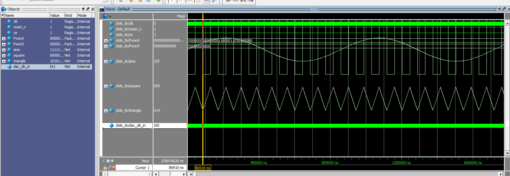

# FPGA+DAC DDS信号发生器实验报告

## 实验任务与要求
本实验基于 FPGA 与 DAC 设计 DDS（Direct Digital Synthesis）信号发生器，实现可控频率与多波形输出，并完成数码管显示功能。

实验要求如下：

1. 频率分辨率优于 10 Hz。  
2. ROM 查找表地址长度为 8 位、数据位宽为 10 位。  
3. 在最高输出频率下，每个输出周期不少于 40 个数据点。  
4. 可切换显示“频率控制字/输出频率”，显示为十六进制；当显示输出频率且低于 100 Hz 时，保留 1 位小数显示。

## 系统原理与方案设计
### 1. DDS 基本原理
DDS 通过“相位累加器 + 波形查找表（ROM）”实现波形合成。其核心关系为：

\[
f_{out}=\frac{Fword\times f_{clk}}{2^N}
\]

其中：

- \(f_{clk}\)：系统时钟频率（本设计为 12 MHz）
- \(N\)：相位累加器位宽（本设计为 21）
- \(Fword\)：频率控制字

### 2. 系统结构
系统由以下模块组成：

1. `dds_top`：顶层模块，负责接口汇总、参数传递与子模块例化。  
2. `dds`：核心 DDS 模块，包含相位累加、ROM 地址生成、波形选择与数据输出。  
3. `rom_sin/rom_squ/rom_tri/rom_saw`：四类波形 ROM 查找表。  
4. `segmentD`：数码管动态扫描显示模块，用于显示控制字或频率值。  

其中 `dds` 模块通过 `select` 选择波形（正弦/方波/三角/锯齿），通过 `sel_out` 切换显示模式。

### 3. 图示位置（待补）
- 图1 系统原理框图（待补）  
- 图2 顶层连接或模块层次图（待补）

## 系统设计步骤与实验结果分析
### 3.1 参数设置与关键计算
项目中选取的参数如下：

- 系统时钟：12 MHz  
- 相位累加器位宽：N = 21  
- 频率控制字位宽：M = 16  
- ROM 参数：`DEPTH = 256`，`WIDTH = 10`  

由公式可得频率分辨率：

\[
\Delta f=\frac{f_{clk}}{2^N}=\frac{12\times10^6}{2^{21}}\approx5.722\ \text{Hz}
\]

因此分辨率优于 10 Hz，满足要求。

为满足“最高频率时每周期不少于 40 点”，需要满足：

\[
\frac{2^N}{Fword}\ge40 \Rightarrow Fword\le\frac{2^{21}}{40}\approx52428.8
\]

取整数上限 `Fword = 52428` 时：

- \(f_{out}\approx299995.42\ \text{Hz}\)
- 每周期采样点数 \(\approx40.0006\) 点

工程仿真中也使用了 `Fword = 52429`（约 300 kHz）进行测试，等效每周期约 40 点（近似满足边界条件）。

### 3.2 设计实现步骤
1. 建立波形查找表  
在 `.mif` 文件中定义 256 深度、10 位幅值数据，分别用于正弦、方波、三角波、锯齿波。  

2. 实现 DDS 核心  
`dds.v` 中完成相位累加器、ROM 地址生成（取高 8 位并叠加相位偏置）、四路 ROM 并行读取与波形选择输出。  

3. 实现顶层与显示  
`dds_top.v` 连接 DDS 输出与数码管显示模块，支持 `sel_out` 显示切换。  
`segmentD.v` 实现 8 位动态扫描与十六进制段码译码，并在频率显示模式下点亮小数点位。  

4. 进行仿真验证  
通过 ModelSim 对模块进行编译和激励，观察时钟、控制字与波形输出关系，检查功能切换是否正确。

### 3.3 实验结果分析
如图3所示，仿真波形中可观察到正弦、方波、三角波等输出，说明 ROM 查表与波形切换逻辑有效。

图3可替换为你后续导出的更清晰波形截图（带时间刻度和信号标注）。

结合源码与仿真记录，可对实验要求进行核对：

1. 分辨率要求：5.722 Hz < 10 Hz，满足。  
2. ROM 位宽与地址长度：8 位地址、10 位数据，满足。  
3. 最高频率数据点数：按 `Fword<=52428` 可满足每周期不少于 40 点；`Fword=52429` 时为近似 40 点边界测试。  
4. 显示功能：支持 `sel_out` 切换显示，段码为十六进制；频率模式支持小数点显示逻辑。  

## 结论
本实验完成了基于 FPGA+DAC 的 DDS 信号发生器设计，实现了多波形输出、频率可控以及显示模式切换。通过参数计算与仿真验证，系统在分辨率、ROM 配置和波形生成方面达到实验目标。

同时，项目中仍有可优化空间：

1. 输出频率显示的换算可进一步标定为严格公式计算，减少近似系数误差。  
2. 可增加按键消抖与频率步进策略，提升人机交互稳定性。  
3. 可补充硬件实测波形（示波器截图）与频谱分析，提高报告完整度和说服力。  

通过本实验，进一步加深了对 DDS 原理、Verilog 模块化设计、ROM 查表波形合成及 FPGA 工程验证流程的理解与实践能力。
